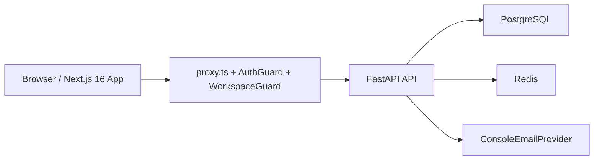

# FastAPI SaaS Starter Kit


A reusable SaaS starter kit built with `Next.js 16`, `FastAPI`, `PostgreSQL`, `SQLModel`, `Redis`, and `Docker Compose`.

This repository gives you the shared SaaS foundation first, so you can add your real product module after auth, workspaces, invites, billing-ready models, and deployment basics are already in place.

## Who this starter is for

- Teams building a new SaaS product and wanting a clean full-stack foundation
- Developers who want cookie-first auth, multi-tenant workspaces, and team management without starting from zero
- Builders who want a Docker-first local workflow with lightweight but real verification

## What ships in the MVP

- Cookie-first auth with secure defaults
- Users and profile settings
- Workspace-based multi-tenancy
- Team members, roles, and invites
- Billing-ready plans and subscriptions
- Dashboard shell and settings pages
- Centralized API errors and basic logging
- Redis-backed rate limiting with in-memory fallback
- Docker Compose and starter documentation

## What is intentionally out of scope

- Product-specific modules such as CRM, inventory, LMS, booking, support, or AI/RAG
- API keys
- Audit logs
- Password reset and email verification
- Real email delivery providers
- Stripe checkout, customer portal, and webhooks

## Tech stack

- Frontend: `Next.js 16`, App Router, React 19, TanStack Query
- Backend: `FastAPI`, `SQLModel`, Alembic
- Data: PostgreSQL
- Caching / limits: Redis
- Local runtime: Docker Compose
- Tests: pytest and Vitest

## Repository layout

```txt
apps/api     FastAPI backend, Alembic migrations, backend tests
apps/web     Next.js frontend, frontend tests
docs/        Architecture, API, security, deployment, and starter guidance
scripts/     Optional verification helpers
```

## Architecture at a glance



Short version:

- the frontend handles routing, dashboard UI, and TanStack Query hooks
- the backend owns auth, workspace rules, invites, billing-ready models, and persistence
- PostgreSQL stores application data
- Redis powers shared rate limiting in runtime environments
- the email adapter stays pluggable while v1 uses `ConsoleEmailProvider`

## Requirements

- Docker Desktop or another Docker engine with Compose support
- Optional for local non-Docker workflows:
  - Python 3.11+
  - Node.js 22+
  - `pnpm`

## Quick start

1. Clone the repository:

```bash
git clone https://github.com/bilalzulfiqar-pk/fastapi-saas-starter-kit.git
cd fastapi-saas-starter-kit
```

2. Copy `.env.example` to `.env`.
3. Start the local stack:

```bash
docker compose up --build
```

If you already have `pnpm` installed, the root shortcut below does the same thing:

```bash
pnpm dev
```

4. Open:

- App: `http://localhost:3000`
- API health: `http://localhost:8000/health`
- API readiness: `http://localhost:8000/readiness`
- API docs: `http://localhost:8000/docs`
- API ReDoc: `http://localhost:8000/redoc`

5. Register the first account and create the first workspace in onboarding.

There is no seed script in the MVP starter. The intended first-run flow is:

1. register a user
2. complete onboarding
3. create the first workspace

To stop the stack:

```bash
docker compose down
```

## Environment variables

All required starter variables are shown in [.env.example](.env.example).

| Variable | Description | Example |
| --- | --- | --- |
| `APP_NAME` | Human-readable application name used by the backend | `FastAPI SaaS Starter Kit` |
| `APP_ENV` | Runtime environment name | `development` |
| `APP_URL` | Public frontend URL used by backend-generated links | `http://localhost:3000` |
| `API_URL` | Public backend URL | `http://localhost:8000` |
| `NEXT_PUBLIC_APP_URL` | Frontend runtime app URL for browser code | `http://localhost:3000` |
| `NEXT_PUBLIC_API_URL` | Frontend runtime API URL for browser code | `http://localhost:8000` |
| `DATABASE_URL` | PostgreSQL connection string | `postgresql+psycopg://postgres:postgres@db:5432/saas_starter` |
| `SECRET_KEY` | Signing key for auth tokens and session-related secrets | `change-me-please-with-at-least-32-bytes` |
| `ACCESS_TOKEN_EXPIRE_MINUTES` | Access-cookie lifetime in minutes | `15` |
| `REFRESH_TOKEN_EXPIRE_DAYS` | Refresh-cookie lifetime in days | `30` |
| `COOKIE_DOMAIN` | Cookie domain. Leave blank in local development for host-only cookies | `""` |
| `COOKIE_SECURE` | Whether cookies require HTTPS | `false` |
| `COOKIE_SAMESITE` | SameSite cookie policy | `lax` |
| `ACCESS_COOKIE_NAME` | Access cookie name | `saas_access_token` |
| `REFRESH_COOKIE_NAME` | Refresh cookie name | `saas_refresh_token` |
| `SESSION_COOKIE_NAME` | Lightweight session marker cookie name | `saas_session` |
| `FRONTEND_ORIGINS` | Trusted browser origins for unsafe request validation | `http://localhost:3000,http://web:3000` |
| `REDIS_URL` | Redis connection string for shared rate limiting | `redis://redis:6379/0` |
| `LOG_LEVEL` | Backend log verbosity | `INFO` |

## Root commands

These commands are available from the repository root:

- `pnpm dev`
  Starts the full Docker Compose stack with rebuilds.
- `pnpm dev:web`
  Starts the Next.js app locally outside Docker.
- `pnpm dev:api`
  Starts the FastAPI app locally outside Docker.
- `pnpm lint`
  Runs the web ESLint checks.
- `pnpm typecheck`
  Runs the web TypeScript checks.
- `pnpm test:api`
  Runs the backend pytest suite.
- `pnpm test:web`
  Runs the frontend Vitest suite.

## Database migrations

The backend uses Alembic for schema migrations.

- From `apps/api`, apply all migrations:
  - `alembic upgrade head`
- From `apps/api`, create a new autogenerated migration after changing SQLModel models:
  - `alembic revision --autogenerate -m "describe your change"`

Example:

```bash
cd apps/api
alembic upgrade head
```

## Roles and permissions

- `owner`
  Full workspace control, including granting, revoking, and removing owner roles.
- `admin`
  Can manage members and invites, but cannot grant, revoke, or remove owner roles.
- `member`
  Basic workspace participation role. Members cannot manage other users, but they can leave a workspace they belong to when that does not violate the last-owner rule.

## Verification before publishing or customizing

Run the core checks:

```bash
pnpm test:api
pnpm lint
pnpm typecheck
pnpm test:web
pnpm --dir apps/web build
docker compose up --build
python scripts/verify_redis_rate_limit.py
```

The Redis script is optional. It verifies that the live Docker stack returns `429` from the login limiter without falling back to the in-memory limiter path.

Recommended smoke flow:

1. Register a new account.
2. Create the first workspace in onboarding.
3. Open the dashboard and each settings page.
4. Send an invite from the members/settings flow.
5. Register or log in as the invited user and accept the invite.
6. Confirm the invited user appears in workspace members.

## Important implementation notes

- The frontend uses `proxy.ts` because this starter targets `Next.js 16`.
- TanStack Query is used for server state through reusable hooks.
- Small UI state stays in React context instead of Zustand.
- Auth uses:
  - a short-lived access cookie
  - a path-scoped refresh cookie
  - a lightweight session marker cookie for protected-route recovery
- `COOKIE_DOMAIN=""` is the development default so cookies remain host-only on localhost.
- Unsafe browser methods require a trusted `Origin` header because auth is cookie-first.
- Real email delivery is intentionally out of scope in v1; `ConsoleEmailProvider` logs email content instead.

## Documentation

- [Architecture](docs/architecture.md)
- [API](docs/api.md)
- [Security](docs/security.md)
- [Deployment](docs/deployment.md)
- [Scripts](scripts/README.md)
- [Starter kit guide](docs/starter-kit/00-start-here.md)

## Customizing this starter

Start with the shared foundation, then add your product-specific modules under:

- `apps/api/app/modules/<your-domain>/`
- `apps/web/features/<your-domain>/`

Keep auth, workspaces, memberships, invites, and billing-ready models reusable until your product direction is stable.

## Contributing

This starter kit is meant to be extended and improved. Feedback, issues, improvements, and feature suggestions are welcome.

## License

This repository is licensed under the [MIT License](LICENSE).
